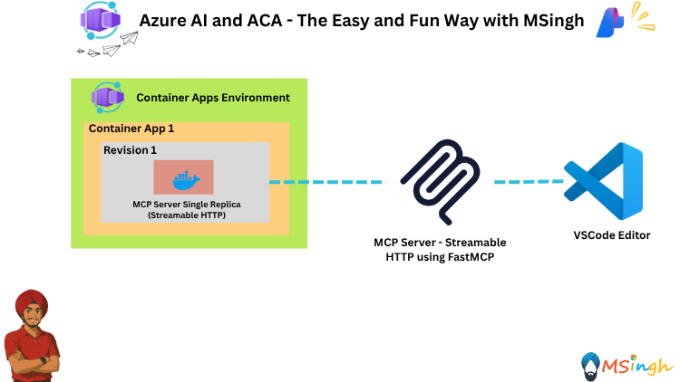

## Building and Publishing a Remote MCP Server to ACA and APIM



### Lab Overview
In this lab, you will build and publish a Model Context Protocol (MCP) server to the Azure Container Apps (ACA) environment and Azure APIM Gateway. This will enable you to build and scale AI applications using MCP servers hosted on ACA.

### Setting Export Variables
Let's quickly set some export variables for script usage.
```bash
export ACR_NAME="YOUR_ACR_NAME"
export RG_NAME="YOUR_RESOURCE_GROUP_NAME"
export ACA_ENV_NAME="YOUR_ACA_ENV_NAME"
```

### Building the MCP Server
The MCP server is built using a Dockerfile located in the `server` directory. Navigate to this directory and build the Docker image.
```bash
# navigate to the server directory
cd server

# build the Docker image
docker build -t $ACR_NAME.azurecr.io/udemy-demo-mcp-server:latest .

# Log in to Azure Container Registry
az acr login --name $ACR_NAME

# Push the Docker image to ACR
docker push $ACR_NAME.azurecr.io/udemy-demo-mcp-server:latest
```

### Publishing the MCP Server to ACA
Now that the Docker image is pushed to ACR, you can create an ACA instance to host the MCP server.
```bash
az containerapp create \
    -g $RG_NAME -n udemy-demo-mcp-server \
    --image $ACR_NAME.azurecr.io/udemy-demo-mcp-server:latest \
    --environment $ACA_ENV_NAME \
    --target-port 8000 \
    --min-replicas 1 \
    --ingress external \
    --registry-server $ACR_NAME.azurecr.io \
    --registry-identity system \
    --system-assigned 
```

### Verifying the Deployment
After the ACA instance is created, you can navigate to the `/mcp` endpoint to verify that the MCP server is running correctly. 

### Integrating with APIM
To expose the MCP server through Azure API Management (APIM), simply enter the ACA URL conjugated with the `/mcp` endpoint into your APIM instance as a new API. This will allow you to manage and monitor access to your MCP server.

### Summary
In this lab, you successfully built and published a remote MCP server to Azure Container Apps. This setup allows you to leverage the scalability and flexibility of ACA for hosting your MCP servers, enabling you to build robust AI applications. In the next lab, we will create an AI Agent that interacts with this MCP server.
