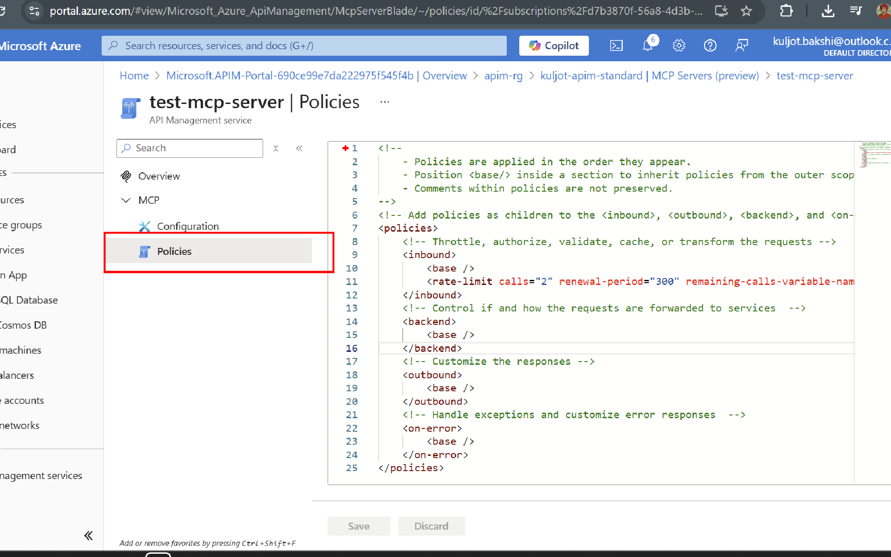

## Implementing Rate Limiting Policy in APIM

### Lab Overview
In this lab, you will implement a rate limiting policy in Azure API Management (APIM) to control the number of requests made to your MCP server. This is essential for protecting your backend services from being overwhelmed by too many requests in a short period.

### Implementing Rate Limiting Policy
Open the `Policies` section of your MCP server in the APIM Instance in Azure Portal as shown in the image below.



Replace the existing policy with the following XML code to implement rate limiting:

```xml
<!--
    - Policies are applied in the order they appear.
    - Position <base/> inside a section to inherit policies from the outer scope.
    - Comments within policies are not preserved.
-->
<!-- Add policies as children to the <inbound>, <outbound>, <backend>, and <on-error> elements -->
<policies>
    <!-- Throttle, authorize, validate, cache, or transform the requests -->
    <inbound>
        <base />
        <rate-limit calls="25" renewal-period="90" remaining-calls-variable-name="remainingCallsPerSubscription"/>
    </inbound>
    <!-- Control if and how the requests are forwarded to services  -->
    <backend>
        <base />
    </backend>
    <!-- Customize the responses -->
    <outbound>
        <base />
    </outbound>
    <!-- Handle exceptions and customize error responses  -->
    <on-error>
        <base />
    </on-error>
</policies>
```
>**Note:** In this example, the rate limit is set to 25 calls every 90 seconds. You can adjust these values based on your requirements. On an average, each MCP interaction may involve multiple API calls, so plan your limits accordingly.

Hit `Save` to apply the policy.

### Summary 
In this lab, you successfully implemented a rate limiting policy in Azure API Management (APIM) for your MCP server. This policy helps protect your backend services from being overwhelmed by too many requests in a short period, ensuring a more reliable and stable application.