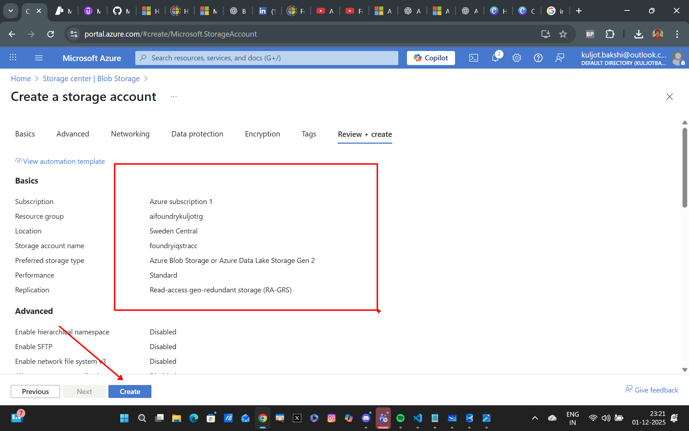
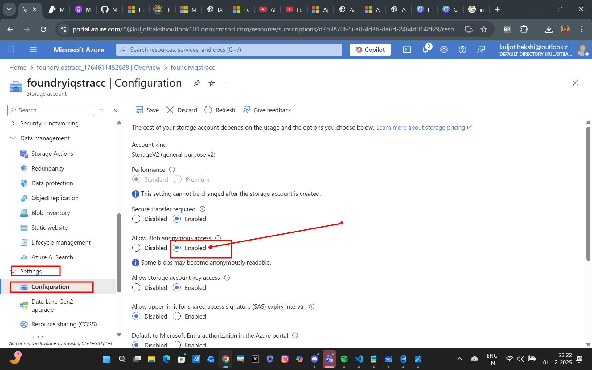
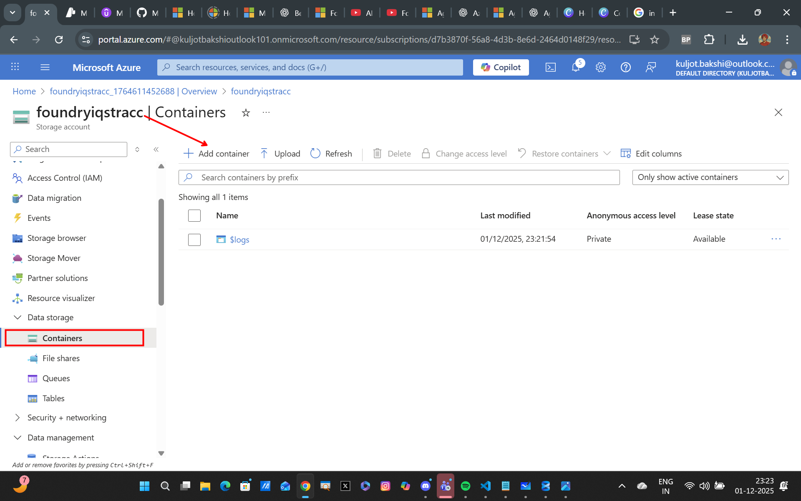
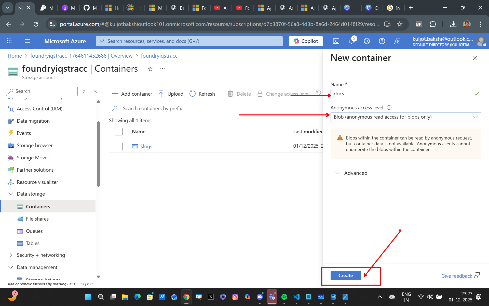
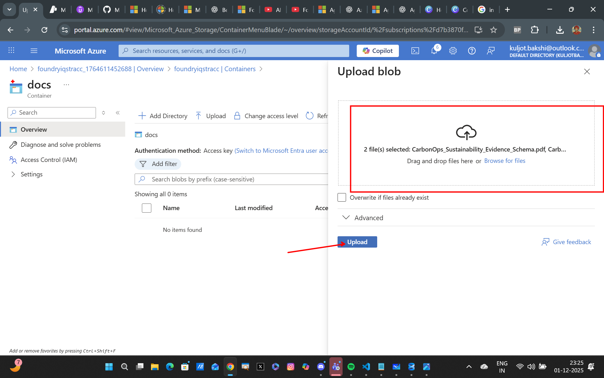
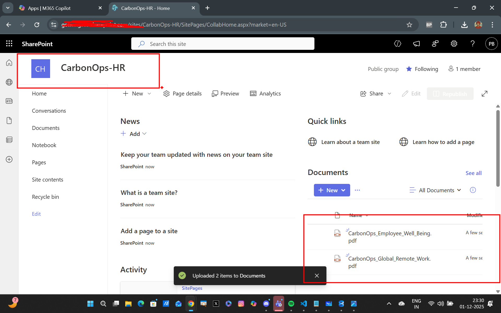
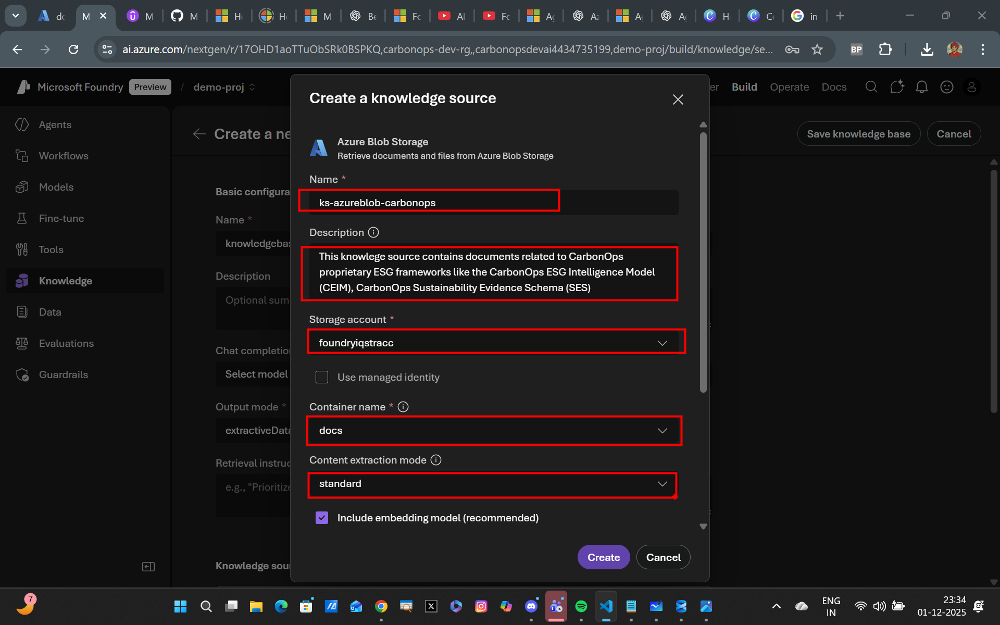
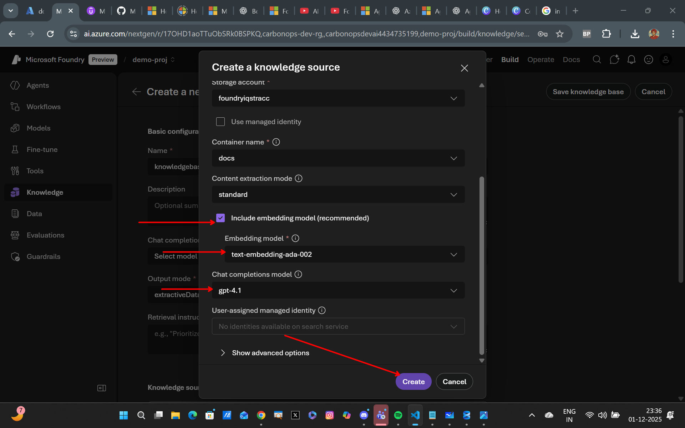
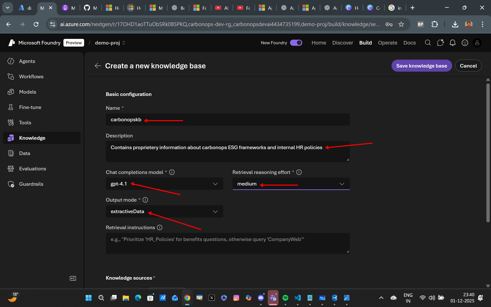
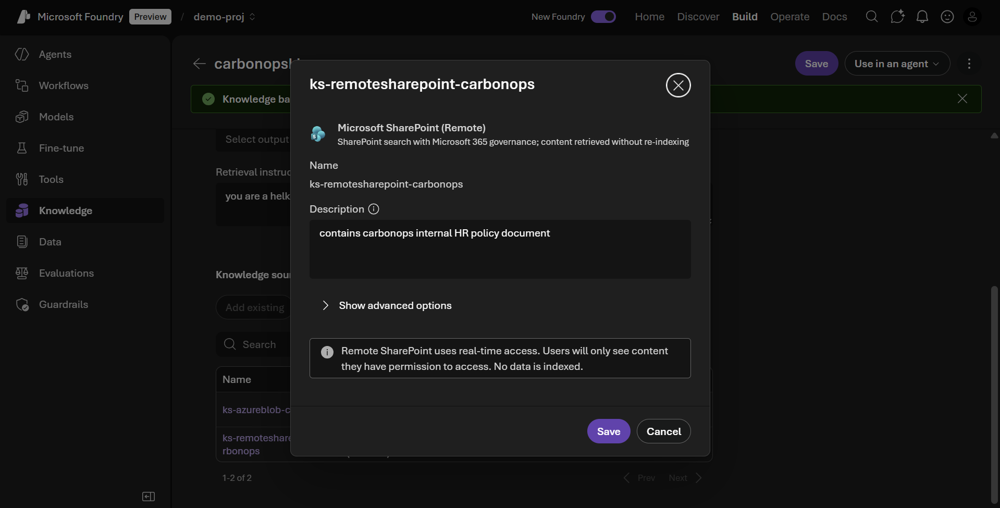

## Upload Data to Azure Blob Storage and SharePoint

### Step 1 - Upoading Documents to Azure Blob Store Container 
Create a Azure Storage account and upload PDF docs in [./Blob](./Blob/) folder to a Blob Storage Container. Follow the steps in the images below:


---

---

---

---

---

### Step 3 - Upload Documents to Sharepoint Site
Upload the Documents in [./SharePoint](./SharePoint/) folder to the sharepoint site you wish to index


---

### Step 4 - Connecting Blob Storage Container as a Knowledge Source to Foundry IQ Knowledge Base
Follow the steps as aligned in the images below.


---

---

### Step 5 - Set Knowledge Base Instructions and Details for Better Agentic Retrieval
After adding the blob storage knowledge source, configure the knowledge base descriptions and details as shown in the image.


---

### Step 6 - Connect SharePoint as a Knowledge Source
Select the option to connect SharePoint as a remote source so that it enables SharePoint Search with Microsoft 365 Governance - content is retrieved without re-indexing in Azure AI Search and respects Microsoft Purview Compliance and Governance Policies


---

### Step 7 - Try the following queries
After building the agent with the Foundry IQ knowledge base attached as a knowledge tool, try these following queries out to see the magic in action:

```markdown
1) Combine the CEIM Impact Flux Score with the Well-Being Pillars Framework to propose a proprietary CarbonOps metric that quantifies how employee well-being influences ESG impact severity. Define the formula, list inputs required from SES metadata, and generate a sample score calculation.

2) Using the CarbonOps Global Remote Work tiers and the CEIM System Boundary Confidence concept, evaluate how a fully distributed team (RW-3) affects CarbonOps regulatory readiness. Provide a quantified readiness score and justify it using SES validation stages.

3) List all proprietary CarbonOps scoring elements (from CEIM, SES, and Well-Being documents) and classify them into: (1) metrics, (2) validation factors, (3) behavioral indicators. Explain how these categories interact during an AI-driven ESG assessment.
```
